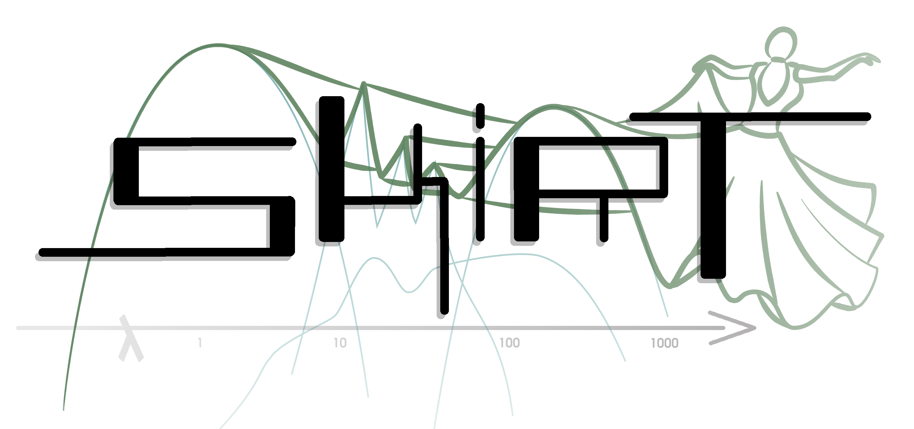

  

# SKIRT design notes

> Design notes for the SKIRT radiative transfer code -- Peter Camps et al. 2026

<small>The existence of these documents does not imply any commitments to implement the described features.</small>

- [SKIRT 10](skirt-10/01-introduction.md)
- [Wavelength grid pool](wavelength-grid-pool/01-introduction.md)
- [Tree-based spatial grids](tree-based-spatial-grids/01-introduction.md)
- [HDF5 input](hdf5-input/01-introduction.md)
- [Iteration history](iteration-history/01-introduction.md)
- [Dynamic grid refinement](dynamic-grid-refinement/01-introduction.md)
- [Dust self-absorption](dust-self-absorption/01-introduction.md)
- [HDF5 output](hdf5-output/01-introduction.md)
- [Checkpointing](checkpointing/01-introduction.md)

 

- [Clumpy torus model](clumpy-torus-model/01-introduction.md)
